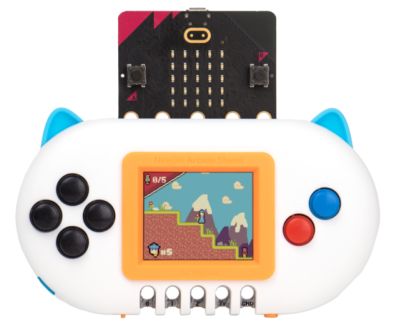

# MakeCode extension: Arcade Shield for BBC micro:bit (V2)

This MakeCode extension allows you to use any of the  MakeCode Arcade shields with the MakeCode for BBC micro:bit editor. The extension provides access 
to the screen and buttons on the shield, and has
a Bitmap abstraction with numerous drawing primitives
(draw line, circle, square, etc).
Bitmaps also can be created using the built-in
image editor in MakeCode.

> **NOTE: This extension will only work in https://makecode.microbit.org/beta**. The extension is still under development and is subject to changes. Please file issues at https://github.com/microbit-apps/pxt-arcadeshield/issues 

## Arcade Shields for the micro:bit V2

Various Arcade shields for the micro:bit V2 are available on the market today, including:

<table>
<tr valign="top">
<td width="33%" >
<a href="https://www.kittenbot.cc/products/newbit-arcade-shield">
Kittenbot's newbit Arcade shield
</a>
</td><td width="33%" >
<a href="https://shop.elecfreaks.com/products/micro-bit-retro-programming-arcade">
ELECFREAK's micro:bit Arcade shield
</a>
</td>
<td width="33%" >
<a href="https://www.icshop.com.tw/products/368112100137?locale=en">
ICShopping's Game:bit Arcade shield
</a>
</td></tr>
<tr>
<td>
<a alt="Kittenbot's newbit Arcade shield" href="https://www.kittenbot.cc/products/newbit-arcade-shield">

</a>
</td><td>
<a alt="ELECFREAK's micro:bit Retro Arcade shield" href="https://shop.elecfreaks.com/products/micro-bit-retro-programming-arcade">

</a>
</td><td>
<a alt="ICShopping's Game:bit" href="https://www.icshop.com.tw/products/368112100137?locale=en">

</a>
</td></tr>
<tr valign="top">
<td>

Small screen. No battery or battery pack included. 3.7V JST power jack on back. One <a href="https://aka.ms/jacdac">Jacdac</a> port.

</td>

<td>

Assembly required. Small screen. AAA Battery pack on back. One <a href="https://aka.ms/jacdac">Jacdac</a> port.

</td>
<td>

No assembly required. Large screen and 3d-printed enclosure with LiPo battery inside. Two <a href="https://aka.ms/jacdac">Jacdac</a> ports.

</td>
</tr>

</table>


## Simulator support

As shown below, the extension provides a simulator for the display,
with keyboard controls mapping to the inputs of
the display shield (A and B buttons, and the four directions of the
D-pad, see arrow buttons).  Blocks
for the shield are under the toolbox categories `Controller` and
`Drawing` and are described further below.


## Blocks

The examples below are illustrative. All blocks have their own
detailed help pages, available from the MakeCode editor. 
More APIs are available via TypeScript.

### Controller

The controller API has event handlers for the A,B and four directions
on the D-pad, as well as the menu button. There also are functions
for polling the buttons. Some example code:

```blocks
controller.A.onEvent(ControllerButtonEvent.Pressed, function () {
    screen().fill(Math.randomRange(1,14))
})
controller.left.onEvent(ControllerButtonEvent.Pressed, function () {
    screen().fill(15)
})
```

Display present/absent
```blocks
```

### Drawing into the screen bitmap

#### Screen coordinates and lines

The screen bitmap is 160 pixels wide and 120 pixels high. 
The upper left of the screen is coordinate (0,0); The lower 
right of the screen is coordinate (159,119).  We draw two lines 
to the screen bitmap to show the four corners of the screen:

```blocks
screen().drawLine(0, 0, 159, 119, 2)
screen().drawLine(159, 0, 0, 119, 5)
```

### Drawing out of bounds

You don't need to worry (for any drawing command) about drawing off
the screen. So, for example,
```blocks
screen().drawLine(-10,10,10,10,2)
```
has the same effect as 
```blocks
screen().drawLine(0,0,10,10,2)
```
While the following code won't display anything on the screen at all:
```blocks
screen().drawLine(-1,=1,-10,-10,2)
```

#### Screen center, setting a pixel, and floating point

Since the width and height of the screen are both even, the center of
the screen is bounded by these four pixels, as shown by the following
four commands that each draw a single pixel:
```
screen().setPixel(79, 59, 1)
screen().setPixel(80, 59, 1)
screen().setPixel(79, 60, 1)
screen().setPixel(80, 60, 1)
```

You can pass floating point numbers to any drawing command that takes 
a coordinate. For efficiency, the underlying representation is fixed point 
in the MakeCode runtime. Fractional values are ignored when setting a pixel 
in a bitmap, so
```blocks
screen().setPixel(79.6, 59.6, 1)
```
has the same effect as 
```blocks
screen().setPixel(79.4, 59.4, 1)
```
which has the same effect as
```blocks
screen().setPixel(79, 59, 1)
```
#### Getting a pixel's (color index) value

The following code will show a 2 on the micro:bit screen, as this is the color index 
stored in the pixel:
```blocks
screen().setPixel(80, 60, 2)
basic.showNumber(screen().getPixel(80, 60))
}
```
So we can see that each pixel is like a variable that stores a value (in the range 0-15)
that can later be retrieved.

#### Drawing shapes

Draw

- rectangle
- circle
- triangle

Fill


### Creating your own bitmaps

#### bitmap editor
#### bitmap as hex literal

### Drawing a bitmap onto the screen

## TypeScript APIs

# Supported targets

- for PXT/microbit

<script src="https://makecode.com/gh-pages-embed.js"></script><script>makeCodeRender("{{ site.makecode.home_url }}", "{{ site.github.owner_name }}/{{ site.github.repository_name }}");</script>
